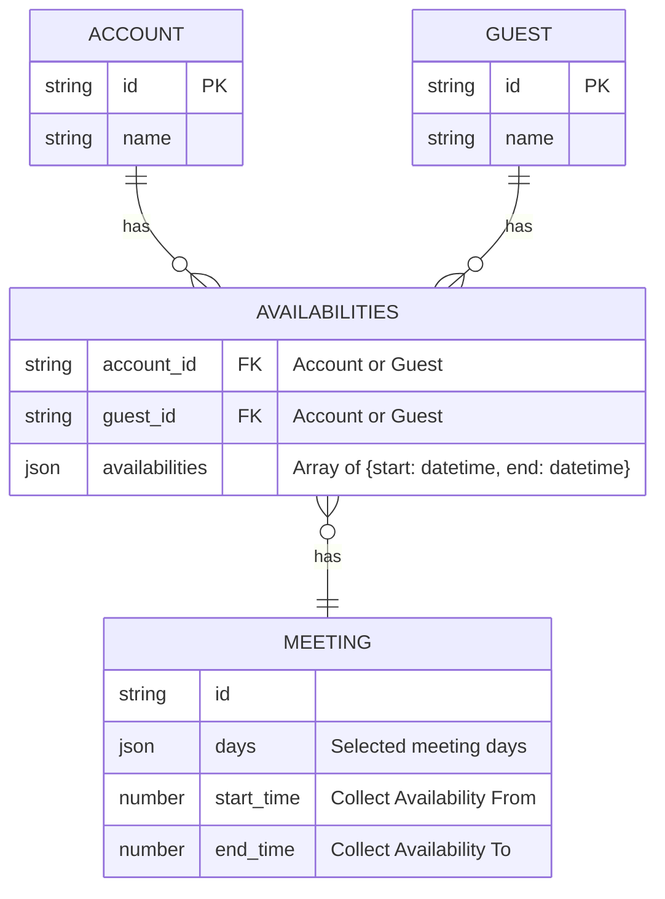

# ZotMeet Database Design Notes

Building off a conversation I had with Sean, here are some updated suggestions / thoughts I had for the DB schema. I've only thought through the core meeting, authed user, guest, and availabilities functionality, so this won't include anything on groups, etc.

## General

Originally, we started with a users / accounts table, a guests table, and a "person" table that represented either a user or a guest. While I wasn't able to put my finger on it at the time, I now realize it feels off because a person row could represent two different things. One of which is a authed user, which is reused across meetings, and the other is a guest user, which is only used once.

It seems that the person table may be unnecessary, and having an account / guest FK column in the availabilites table makes more semantic sense.

The above schema uses a JSON array of datetime ranges to store availability. I feel that further separating the datetime ranges into another table is unnessary because the smallest transaction we're making is replacing a user's entire availability. For example, adding two different time blocks from two different clients (for the same user) and expecting a merged result is explicitly not supported.

## Timezone Considerations

For timezones, the only edge case I've seriously considered is Daylight Savings Time. Given that PG itself [explicitly doesn't account for future rule changes](https://www.postgresql.org/docs/current/datatype-datetime.html#:~:text=For%20times%20in%20the%20future%2C%20the%20assumption%20is%20that%20the%20latest%20known%20rules%20for%20a%20given%20time%20zone%20will%20continue%20to%20be%20observed%20indefinitely%20far%20into%20the%20future.), I feel it's not an important detail for the moment. The only scenario I can think of that might happen and cause an issue is if we suddenly stop observing DST.

### Storing No Timezone

i.e. free from 3:30 PST to 4:00 PST\
assuming meetings have timezones and is PST\
stored as `{ start: 3:00, end: 4:00}`

This method would result in [ambiguous timestamps](https://www.postgresql.org/docs/current/datetime-invalid-input.html) between 1-2 when rolling back DST. There exist two 1:30s.

### Storing Offset

Storing the IANA time zone (America/Los_Angeles) also fails to address the ambiguous datetime issue. The solution is to store an offset instead (-4). Naturally, the next question is what timezone to store the users availability in — meeting timezone (if we choose to have one) or user timezone. This begs the question of if it's even necessary to store timestamps with offsets at all. While, IANA timezones account for future rule changes, we lose that when storing offsets anyways. Regardless, we would also need a "right" timezone.

e.g. Meeting is at 8:00 PDT, which is 9:00 PST, and 6:00 CET. If we suddenly stop observing DST, the originally scheduled meeting would suddently be at 9 for the PT user (with UTC being the source of true). Naturally both the PT and CET users expect the meeting to be at the original "time" they selected. This means there must be a primary timezone and the meeting time would be shifted for users outside that timezone.

With all this being said, it might then be easier to just store the user's timezone alongside their avaibility in UTC.

tldr; just store the availability in utc and store the timezone for rendering ui.

I'm still uncertain if using datetime ranges is easier and more robust than a bitwise number. However, the timezone considerations still apply, and I also don't currently see a compelling reason to reintroduce an intermediary people table.

